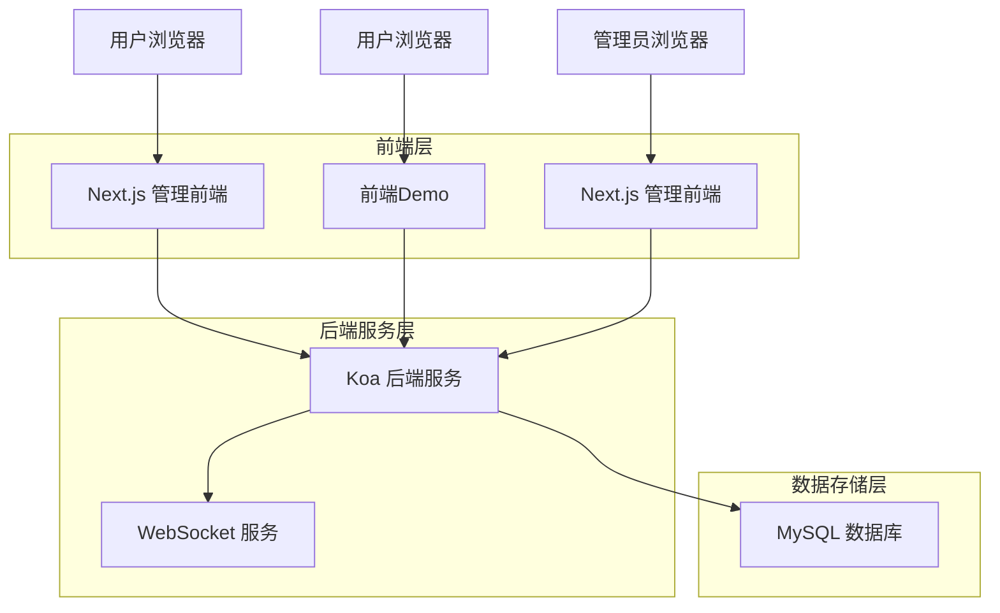
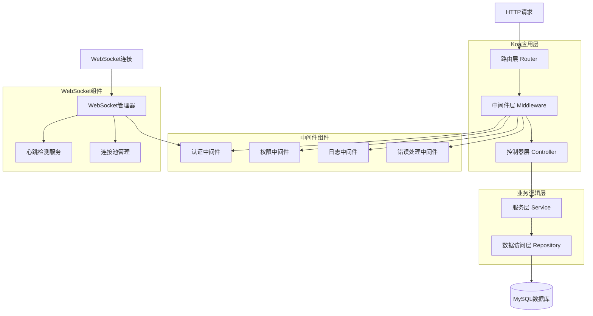
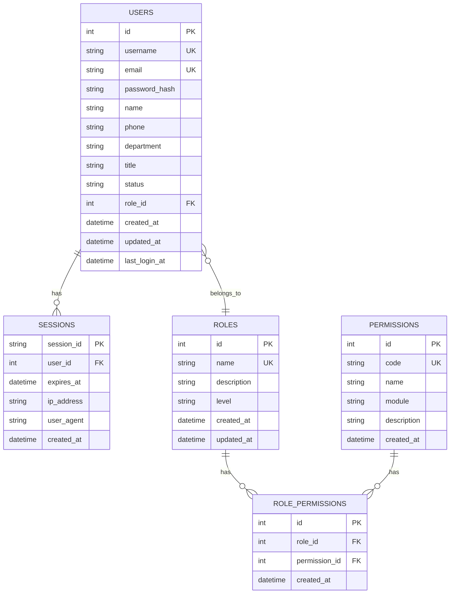

# 后台管理系统技术架构文档

## 1. 架构设计



## 2. 技术描述

- **后端**: Koa@2 + MySQL2 + bcrypt + jsonwebtoken + ws
- **管理前端**: Next.js@14 + React@18 + TypeScript + Tailwind CSS
- **Demo前端**: HTML5 + JavaScript + 原生WebSocket API
- **数据库**: MySQL@8
- **初始化工具**: create-next-app (管理前端)

## 3. 路由定义

### 管理前端 (Next.js)
| 路由 | 用途 |
|------|------|
| `/` | 登录页面，管理员身份验证 |
| `/dashboard` | 仪表板页面，系统概览 |
| `/users` | 用户管理页面，用户列表和管理 |
| `/users/[id]` | 用户详情页面，查看和编辑用户信息 |
| `/roles` | 角色管理页面，RBAC角色配置 |
| `/permissions` | 权限管理页面，系统权限配置 |
| `/profile` | 个人资料页面，当前登录用户信息 |

### 后端API (Koa)
| 路由 | 用途 |
|------|------|
| `POST /api/auth/register` | 用户注册接口 |
| `POST /api/auth/login` | 用户登录接口 |
| `POST /api/auth/logout` | 用户登出接口 |
| `GET /api/auth/session` | 会话验证接口 |
| `GET /api/users` | 获取用户列表（分页、搜索、筛选） |
| `GET /api/users/:id` | 获取单个用户信息 |
| `POST /api/users` | 创建新用户 |
| `PUT /api/users/:id` | 更新用户信息 |
| `DELETE /api/users/:id` | 删除用户 |
| `PATCH /api/users/:id/status` | 更新用户状态（启用/禁用） |
| `GET /api/roles` | 获取角色列表 |
| `POST /api/roles` | 创建角色 |
| `PUT /api/roles/:id` | 更新角色信息 |
| `DELETE /api/roles/:id` | 删除角色 |
| `GET /api/permissions` | 获取权限列表 |
| `GET /api/admin/stats` | 获取系统统计信息 |

## 4. API定义

### 4.1 认证相关API

**用户注册**
```
POST /api/auth/register
```

请求参数：
| 参数名 | 类型 | 必填 | 描述 |
|--------|------|------|------|
| username | string | 是 | 用户名，唯一 |
| password | string | 是 | 密码，最小6位 |
| email | string | 是 | 邮箱地址 |
| name | string | 是 | 真实姓名 |
| phone | string | 否 | 联系电话 |
| department | string | 否 | 所属部门 |
| title | string | 否 | 职位 |

响应示例：
```json
{
  "success": true,
  "data": {
    "sessionId": "550e8400-e29b-41d4-a716-446655440000",
    "user": {
      "id": 1,
      "username": "admin",
      "email": "admin@example.com",
      "name": "管理员"
    }
  }
}
```

**用户登录**
```
POST /api/auth/login
```

请求参数：
| 参数名 | 类型 | 必填 | 描述 |
|--------|------|------|------|
| username | string | 是 | 用户名 |
| password | string | 是 | 密码 |

响应示例：
```json
{
  "success": true,
  "data": {
    "sessionId": "550e8400-e29b-41d4-a716-446655440000",
    "user": {
      "id": 1,
      "username": "admin",
      "email": "admin@example.com",
      "name": "管理员",
      "role": "super_admin"
    }
  }
}
```

### 4.2 用户管理API

**获取用户列表**
```
GET /api/users?page=1&pageSize=10&search=keyword&status=active&role=user
```

查询参数：
| 参数名 | 类型 | 必填 | 描述 |
|--------|------|------|------|
| page | number | 否 | 页码，默认1 |
| pageSize | number | 否 | 每页条数，默认10 |
| search | string | 否 | 搜索关键词（用户名、姓名、邮箱） |
| status | string | 否 | 状态筛选：active, inactive |
| role | string | 否 | 角色筛选 |
| department | string | 否 | 部门筛选 |

响应示例：
```json
{
  "success": true,
  "data": {
    "list": [
      {
        "id": 1,
        "username": "admin",
        "email": "admin@example.com",
        "name": "管理员",
        "phone": "13800138000",
        "department": "技术部",
        "title": "技术总监",
        "status": "active",
        "role": "super_admin",
        "createdAt": "2024-01-01T00:00:00Z",
        "lastLoginAt": "2024-01-15T10:30:00Z"
      }
    ],
    "total": 100,
    "page": 1,
    "pageSize": 10
  }
}
```

**更新用户状态**
```
PATCH /api/users/:id/status
```

请求参数：
| 参数名 | 类型 | 必填 | 描述 |
|--------|------|------|------|
| status | string | 是 | 状态：active, inactive |

## 5. 服务器架构图



## 6. 数据模型

### 6.1 数据模型定义



### 6.2 数据定义语言

**用户表 (users)**
```sql
-- 创建用户表
CREATE TABLE users (
    id INT PRIMARY KEY AUTO_INCREMENT,
    username VARCHAR(50) UNIQUE NOT NULL COMMENT '用户名',
    email VARCHAR(100) UNIQUE NOT NULL COMMENT '邮箱',
    password_hash VARCHAR(255) NOT NULL COMMENT '加密密码',
    name VARCHAR(100) NOT NULL COMMENT '真实姓名',
    phone VARCHAR(20) COMMENT '联系电话',
    department VARCHAR(100) COMMENT '所属部门',
    title VARCHAR(100) COMMENT '职位',
    status ENUM('active', 'inactive') DEFAULT 'active' COMMENT '状态',
    role_id INT COMMENT '角色ID',
    created_at TIMESTAMP DEFAULT CURRENT_TIMESTAMP,
    updated_at TIMESTAMP DEFAULT CURRENT_TIMESTAMP ON UPDATE CURRENT_TIMESTAMP,
    last_login_at TIMESTAMP NULL COMMENT '最后登录时间',
    INDEX idx_username (username),
    INDEX idx_email (email),
    INDEX idx_status (status),
    INDEX idx_role_id (role_id),
    FOREIGN KEY (role_id) REFERENCES roles(id)
) ENGINE=InnoDB DEFAULT CHARSET=utf8mb4 COLLATE=utf8mb4_unicode_ci;

-- 插入超级管理员用户
INSERT INTO users (username, email, password_hash, name, department, title, status, role_id) 
VALUES ('admin', 'admin@example.com', '$2b$10$92IXUNpkjO0rOQ5byMi.Ye4oKoEa3Ro9llC/.og/at2.uheWG/igi', '超级管理员', '技术部', '系统管理员', 'active', 1);
```

**角色表 (roles)**
```sql
-- 创建角色表
CREATE TABLE roles (
    id INT PRIMARY KEY AUTO_INCREMENT,
    name VARCHAR(50) UNIQUE NOT NULL COMMENT '角色名称',
    description TEXT COMMENT '角色描述',
    level ENUM('super_admin', 'admin', 'user') DEFAULT 'user' COMMENT '角色级别',
    created_at TIMESTAMP DEFAULT CURRENT_TIMESTAMP,
    updated_at TIMESTAMP DEFAULT CURRENT_TIMESTAMP ON UPDATE CURRENT_TIMESTAMP,
    INDEX idx_name (name),
    INDEX idx_level (level)
) ENGINE=InnoDB DEFAULT CHARSET=utf8mb4 COLLATE=utf8mb4_unicode_ci;

-- 插入默认角色
INSERT INTO roles (name, description, level) VALUES 
('超级管理员', '拥有系统所有权限', 'super_admin'),
('管理员', '拥有大部分管理权限', 'admin'),
('普通用户', '基础用户权限', 'user');
```

**权限表 (permissions)**
```sql
-- 创建权限表
CREATE TABLE permissions (
    id INT PRIMARY KEY AUTO_INCREMENT,
    code VARCHAR(100) UNIQUE NOT NULL COMMENT '权限代码',
    name VARCHAR(100) NOT NULL COMMENT '权限名称',
    module VARCHAR(50) NOT NULL COMMENT '所属模块',
    description TEXT COMMENT '权限描述',
    created_at TIMESTAMP DEFAULT CURRENT_TIMESTAMP,
    INDEX idx_code (code),
    INDEX idx_module (module)
) ENGINE=InnoDB DEFAULT CHARSET=utf8mb4 COLLATE=utf8mb4_unicode_ci;

-- 插入基础权限
INSERT INTO permissions (code, name, module, description) VALUES
('user.view', '查看用户', '用户管理', '查看用户列表和详情'),
('user.create', '创建用户', '用户管理', '创建新用户'),
('user.update', '更新用户', '用户管理', '更新用户信息'),
('user.delete', '删除用户', '用户管理', '删除用户'),
('role.view', '查看角色', '角色管理', '查看角色列表和详情'),
('role.create', '创建角色', '角色管理', '创建新角色'),
('role.update', '更新角色', '角色管理', '更新角色信息'),
('role.delete', '删除角色', '角色管理', '删除角色'),
('admin.access', '访问后台', '系统管理', '访问后台管理系统');
```

**会话表 (sessions)**
```sql
-- 创建会话表
CREATE TABLE sessions (
    session_id VARCHAR(128) PRIMARY KEY COMMENT '会话ID',
    user_id INT NOT NULL COMMENT '用户ID',
    expires_at TIMESTAMP NOT NULL COMMENT '过期时间',
    ip_address VARCHAR(45) COMMENT 'IP地址',
    user_agent TEXT COMMENT '用户代理',
    created_at TIMESTAMP DEFAULT CURRENT_TIMESTAMP,
    INDEX idx_user_id (user_id),
    INDEX idx_expires_at (expires_at),
    FOREIGN KEY (user_id) REFERENCES users(id) ON DELETE CASCADE
) ENGINE=InnoDB DEFAULT CHARSET=utf8mb4 COLLATE=utf8mb4_unicode_ci;
```

## 7. WebSocket协议设计

### 7.1 连接流程
1. 客户端通过HTTP API获取sessionId
2. 建立WebSocket连接到 `ws://localhost:3001`
3. 发送注册消息：`{type: "register", sessionId: "xxx"}`
4. 服务器验证sessionId有效性
5. 验证通过后建立持久连接

### 7.2 消息格式

**客户端发送消息**
```json
{
  "type": "message",
  "content": "用户输入的内容"
}
```

**服务端推送消息**
```json
{
  "type": "stream_start",
  "from": "Bot"
}
```

```json
{
  "type": "stream",
  "content": "消息片段"
}
```

```json
{
  "type": "stream_end"
}
```

### 7.3 心跳机制
- 客户端每30秒发送一次心跳：`{type: "ping"}`
- 服务端响应：`{type: "pong"}`
- 超过90秒无响应则断开连接

## 8. 项目结构

### 8.1 后端项目结构 (Koa)
```
backend/
├── src/
│   ├── config/              # 配置文件
│   │   ├── database.js     # 数据库配置
│   │   ├── auth.js         # 认证配置
│   │   └── websocket.js    # WebSocket配置
│   ├── controllers/          # 控制器层
│   │   ├── authController.js
│   │   ├── userController.js
│   │   ├── roleController.js
│   │   └── adminController.js
│   ├── services/           # 服务层
│   │   ├── authService.js
│   │   ├── userService.js
│   │   ├── roleService.js
│   │   └── websocketService.js
│   ├── repositories/       # 数据访问层
│   │   ├── userRepository.js
│   │   ├── roleRepository.js
│   │   └── sessionRepository.js
│   ├── middleware/         # 中间件
│   │   ├── auth.js         # 认证中间件
│   │   ├── rbac.js         # 权限中间件
│   │   ├── logger.js       # 日志中间件
│   │   └── errorHandler.js # 错误处理
│   ├── models/             # 数据模型
│   │   ├── User.js
│   │   ├── Role.js
│   │   ├── Permission.js
│   │   └── Session.js
│   ├── utils/              # 工具函数
│   │   ├── bcrypt.js      # 密码加密
│   │   ├── jwt.js         # JWT工具
│   │   ├── validator.js   # 数据验证
│   │   └── logger.js      # 日志工具
│   ├── websocket/          # WebSocket相关
│   │   ├── connectionManager.js
│   │   ├── heartbeat.js
│   │   └── messageHandler.js
│   └── app.js              # 应用入口
├── tests/                  # 测试文件
├── docs/                   # 文档
├── package.json
└── README.md
```

### 8.2 管理前端结构 (Next.js)
```
admin-frontend/
├── src/
│   ├── app/                # Next.js App Router
│   │   ├── (auth)/         # 认证相关页面
│   │   │   ├── login/      # 登录页面
│   │   │   └── layout.js
│   │   ├── (dashboard)/    # 主控制台
│   │   │   ├── dashboard/  # 仪表板
│   │   │   ├── users/      # 用户管理
│   │   │   ├── roles/      # 角色管理
│   │   │   └── layout.js
│   │   ├── api/            # API路由
│   │   └── layout.js       # 根布局
│   ├── components/         # 通用组件
│   │   ├── ui/            # 基础UI组件
│   │   ├── forms/         # 表单组件
│   │   ├── tables/        # 表格组件
│   │   └── charts/        # 图表组件
│   ├── lib/               # 工具库
│   │   ├── api.js         # API客户端
│   │   ├── auth.js        # 认证工具
│   │   └── utils.js       # 通用工具
│   ├── hooks/             # 自定义Hooks
│   │   ├── useAuth.js
│   │   ├── useUsers.js
│   │   └── useRoles.js
│   ├── store/             # 状态管理
│   │   ├── authStore.js
│   │   └── userStore.js
│   └── styles/            # 样式文件
├── public/                  # 静态资源
├── package.json
└── README.md
```

### 8.3 Demo前端结构
```
frontend-demo/
├── index.html      # 主页面
├── sdk.js          # SDK文件
├── style.css       # 样式文件
└── README.md       # 使用说明
```

## 9. 安全设计

### 9.1 认证安全
- 使用bcrypt进行密码加密，salt rounds为10
- 使用JWT生成sessionId，设置合理的过期时间
- 实现会话管理，支持单点登录控制
- 定期清理过期会话

### 9.2 权限安全
- 基于RBAC模型的权限控制
- 超级管理员拥有所有权限
- 普通管理员只能管理普通用户
- 实现细粒度的权限校验

### 9.3 数据安全
- 敏感数据加密存储
- SQL注入防护
- XSS攻击防护
- CSRF防护
- 输入数据验证和过滤

### 9.4 网络安全
- WebSocket连接认证
- 心跳检测防止连接泄露
- 连接池管理防止资源耗尽
- 请求频率限制

## 10. 性能优化

### 10.1 数据库优化
- 合理的索引设计
- 查询优化
- 连接池配置
- 分页查询

### 10.2 缓存策略
- 会话缓存
- 用户权限缓存
- 热点数据缓存

### 10.3 前端优化
- 组件懒加载
- 数据虚拟滚动
- 请求防抖节流
- 静态资源压缩

## 11. 部署方案

### 11.1 开发环境
```bash
# 后端
npm install
npm run dev

# 管理前端
cd admin-frontend
npm install
npm run dev

# Demo前端
直接打开 index.html 文件
```

### 11.2 生产环境
- 使用PM2管理Node.js进程
- Nginx反向代理
- SSL证书配置
- 数据库备份策略
- 日志收集和分析

### 11.3 Docker 部署
系统支持使用 Docker 和 Docker Compose 进行容器化部署。
在 `admin-backend` 目录下提供了 `docker-compose.yml` 用于快速拉起 MySQL 数据库环境：

```yaml
version: '3.8'

services:
  mysql:
    image: mysql:8.0
    container_name: push_channel_mysql
    environment:
      MYSQL_ROOT_PASSWORD: rootpassword
      MYSQL_DATABASE: admin_db
      MYSQL_USER: admin_user
      MYSQL_PASSWORD: admin_password
    ports:
      - "3306:3306"
    volumes:
      - ./mysql/init.sql:/docker-entrypoint-initdb.d/init.sql
      - mysql_data:/var/lib/mysql
    restart: unless-stopped
    command: --default-authentication-plugin=mysql_native_password

volumes:
  mysql_data:
```

## 12. 错误处理与日志

### 12.1 错误码定义
| 错误码 | HTTP状态码 | 描述 |
|--------|------------|------|
| 0 | 200 | 成功 |
| 40001 | 400 | 请求参数错误 |
| 40101 | 401 | 未登录或Token无效 |
| 40102 | 401 | Token已过期 |
| 40301 | 403 | 无权限访问此资源 |
| 40401 | 404 | 资源不存在 |
| 50001 | 500 | 服务器内部错误 |

### 12.2 日志规范
- **访问日志**: 记录所有API请求，包括请求路径、方法、IP、耗时等。
- **错误日志**: 详细记录错误堆栈信息，便于排查问题。
- **业务日志**: 记录关键业务操作，如用户登录、权限修改等。
- 日志分级：`DEBUG`, `INFO`, `WARN`, `ERROR`
- 日志按天进行滚动轮转存储 (Log Rotation)

## 13. 开发规范

### 13.1 代码规范
- 使用 ESLint + Prettier 统一代码风格
- 遵循统一的命名规范（变量小驼峰，类名大驼峰，常量全大写加下划线）
- 关键业务逻辑和复杂算法必须编写注释

### 13.2 Git提交规范
遵循 Angular 规范，提交格式如下：
`<type>(<scope>): <subject>`

常用的 `type`：
- `feat`: 新功能
- `fix`: 修复bug
- `docs`: 文档修改
- `style`: 代码格式修改（不影响逻辑）
- `refactor`: 重构代码
- `test`: 测试用例
- `chore`: 构建过程或辅助工具变动

## 14. 附录
- 遗留问题跟踪
- 第三方依赖清单及版本号
- 系统默认配置项说明